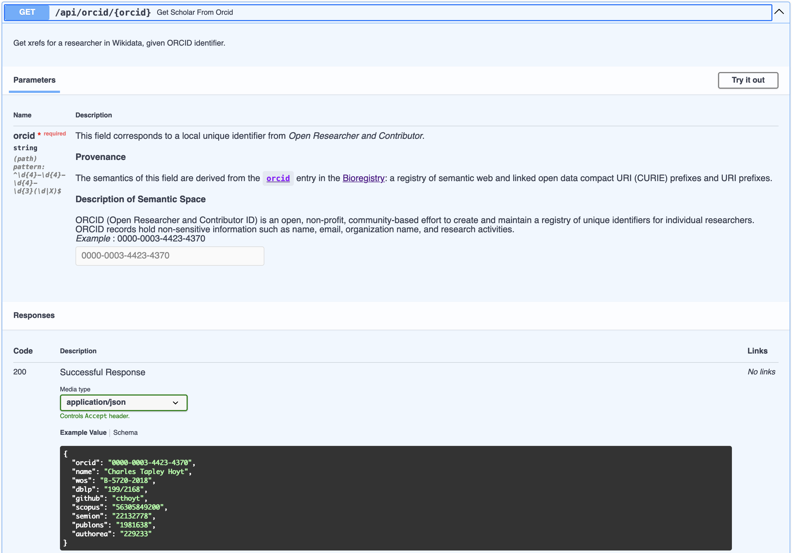

# Semantic Pydantic

> Annotate your data models in Pydantic and APIs in FastAPI with the Bioregistry to make them more FAIR

The demo can be run by cloning the repository, installing its requirements, and
running the self-contained `app.py`.

```shell
git clone https://github.com/cthoyt/semantic-pydantic
cd semantic-pydantic
python -m pip install -r requirements.txt
python app.py
```

Using [Pydantic](https://docs.pydantic.dev) for encoding data models and [FastAPI](https://fastapi.tiangolo.com)
for implementing APIs on top of them has become a staple for many Python programmers. When this intersects
with the semantic web, linked open data, and the natural sciences, we are still lacking a bridge to annotate
our data models and APIs to make them more FAIR (findable, accessible, interoperable, and reusable).
In this post, we build an extension to Pydantic and FastAPI to annotate data models' fields and API endpoints'
query, path, and other parameters using the [Bioregistry](https://bioregistry.io), a comprehensive catalog of metadata
about semantic spaces from the semantic web and the natural sciences.

As a demonstration, we will build a data model and API that serves information about scholars.

## First Steps with Pydantic

We'll use [Open Researcher and Contributor (ORCID)](https://orcid.org/) identifiers as primary keys,
include the researcher's name, and start with a single cross-reference, e.g., to the author's [DBLP](https://dblp.org/)
identifier. We'll encode this data model using [Pydantic](https://docs.pydantic.dev/latest/) in the Python
programming language as follows:

```python
from pydantic import BaseModel, Field


class ScholarV1(BaseModel):
    """A model representing a researcher, who might have several IDs on different services."""

    orcid: str = Field(...)
    name: str = Field(...)
    dblp: str | None = Field(None)


print(ScholarV1.schema_json(indent=2))
```

<details>
<summary>JSON Schema - Version 1</summary>

```json
{
  "title": "ScholarV1",
  "description": "A model representing a researcher, who might have several IDs on different services.",
  "type": "object",
  "properties": {
    "orcid": {
      "title": "Orcid",
      "type": "string"
    },
    "name": {
      "title": "Name",
      "type": "string"
    },
    "dblp": {
      "title": "Dblp",
      "type": "string"
    }
  },
  "required": [
    "orcid",
    "name"
  ]
}
```

</details>

There are several places for improvement here:

1. Correct capitalization of the titles (`ORCID` instead of `Orcid` and `DBLP` instead of `Dblp`)
2. Add useful descriptions of what each field is
3. Have regular expression patterns to validate input
4. Give an example

All of these are possible to annotate into Pydantic's `Field` object, but it requires lots of effort and takes lots of
space. Even worse, this might have to be partially duplicated if multiple models share the same fields. In the example
below, I annotated ORCID but will skip the others for brevity.

```python
from pydantic import BaseModel, Field


class ScholarV2(BaseModel):
    """A model representing a researcher, who might have several IDs on different services."""

    orcid: str = Field(
        ...,
        title="ORCID",
        description="A stable, public identifier for a researcher from https://orcid.com",
        pattern="^\d{4}-\d{4}-\d{4}-\d{3}(\d|X)$",
        example="0000-0003-4423-4370",
    )
    name: str = Field(...)
    dblp: str | None = Field(None)


print(ScholarV2.schema_json(indent=2))
```

<details>
<summary>JSON Schema - Version 2</summary>

```json
{
  "title": "ScholarV2",
  "description": "A model representing a researcher, who might have several IDs on different services.",
  "type": "object",
  "properties": {
    "orcid": {
      "title": "ORCID",
      "description": "A stable, public identifier for a researcher from https://orcid.com",
      "pattern": "^\\d{4}-\\d{4}-\\d{4}-\\d{3}(\\d|X)$",
      "example": "0000-0003-4423-4370",
      "type": "string"
    },
    "name": {
      "title": "Name",
      "type": "string"
    },
    "dblp": {
      "title": "Dblp",
      "type": "string"
    }
  },
  "required": [
    "orcid",
    "name"
  ]
}
```

</details>

However, this was a lot of work. It would be nice if there were some database of all the semantic spaces
in the semantic web and natural sciences that contained the name, description, regular expression pattern,
and examples. Then, we could draw from this database to automatically populate our fields.

## Adding Some Bioregistry Magic

The good news is that such a database exists - it's called the [Bioregistry](https://bioregistry.io). Each semantic
space (e.g., ORCID, DBLP) gets a _prefix_ which is usually an acronym for the name of the resource
that serves as the primary key for the semantic space. These prefixes are also useful in making references to
entities in the semantic space more FAIR (findable, accessible, interoperable, reusable) using the [compact
URI (CURIE) syntax](https://cthoyt.com/2021/09/14/curies.html), though this isn't the goal of this demo.

I've mocked some Python code that bridges Pydantic and the Bioregistry in this
repository (https://github.com/cthoyt/semantic-pydantic). I'm calling it **Semantic Pydantic** because it
lets us annotate our data models with external metadata (and because it rhymes).

Here's the same model as before, but now using a `SemanticField` that extends Pydantic's `Field`. It has a special
keyword `prefix` that lets you give a Bioregistry prefix, then it is smart enough to fill out all the fields
on its own. I also took the liberty of adding several more semantic spaces that identify scholars like
[Web of Science (`wos`)](https://bioregistry.io/wos.researcher),
[Scopus](https://bioregistry.io/scopus), and even [GitHub](https://bioregistry.io/github).

```python
from pydantic import BaseModel, Field

from semantic_pydantic import SemanticField


class ScholarV3(BaseModel):
    """A model representing a researcher, who might have several IDs on different services."""

    orcid: str = SemanticField(..., prefix="orcid")
    name: str = Field(..., example="Charles Tapley Hoyt")

    wos: str | None = SemanticField(default=None, prefix="wos.researcher")
    dblp: str | None = SemanticField(default=None, prefix="dblp.author")
    github: str | None = SemanticField(default=None, prefix="github")
    scopus: str | None = SemanticField(default=None, prefix="scopus")
    semion: str | None = SemanticField(default=None, prefix="semion")
    publons: str | None = SemanticField(default=None, prefix="publons.researcher")
    authorea: str | None = SemanticField(default=None, prefix="authorea.author")


print(ScholarV3.schema_json(indent=2))
```

Finally, we can see a very detailed JSON schema, which includes everything from before plus additional
context from the Bioregistry, including the prefix itself as well as mappings from the Bioregistry prefix
to external registries
like [BARTOC](https://bioregistry.io/metaregistry/bartoc), [FAIRsharing](https://bioregistry.io/metaregistry/fairsharing),
and others. Together, these make the data model more FAIR and support interoperability, since now it is possible to
directly match the fields annotated with Bioregistry prefixes in this model to fields annotated with the same prefix in
other models, even external to the project.

<details>
<summary>JSON Schema - Version 3</summary>

```json
{
  "title": "ScholarV3",
  "description": "A model representing a researcher, who might have several IDs on different services.",
  "type": "object",
  "properties": {
    "orcid": {
      "title": "Open Researcher and Contributor",
      "description": "<p>This field corresponds to a local unique identifier from <i>Open Researcher and Contributor</i></a>.\n</p><h4>Provenance</h4><p>The semantics of this field are derived from the\n<a href=\"https://bioregistry.io/orcid\"><code>orcid</code></a> entry in\nthe <a href=\"https://bioregistry.io\">Bioregistry</a>: a registry of semantic web and linked \nopen data compact URI (CURIE) prefixes and URI prefixes.\n</p><h4>Description of Semantic Space</h4>ORCID (Open Researcher and Contributor ID) is an open, non-profit, community-based effort to create and maintain a registry of unique identifiers for individual researchers. ORCID records hold non-sensitive information such as name, email, organization name, and research activities.",
      "pattern": "^\\d{4}-\\d{4}-\\d{4}-\\d{3}(\\d|X)$",
      "example": "0000-0003-4423-4370",
      "json_schema_extra": {
        "bioregistry": {
          "prefix": "orcid",
          "mappings": {
            "bartoc": "2021",
            "biocontext": "ORCID",
            "biolink": "ORCID",
            "fairsharing": "FAIRsharing.nx58jg",
            "go": "orcid",
            "miriam": "orcid",
            "n2t": "orcid",
            "wikidata": "P496"
          }
        }
      },
      "type": "string"
    },
    "name": {
      "title": "Name",
      "example": "Charles Tapley Hoyt",
      "type": "string"
    },
    ...
  }
}
```

Note that the extra semantic fields have been truncated for brevity. Each of them also has lots of detailed information.
</details>

## Web Application

Let's take the next step to a web application using FastAPI. The goal of this web application will be to look
up the information for a scholar in Wikidata based on their ORCID. You don't really have to understand how the
query works other than that it takes in an ORCID string and gives back an instance of the Scholar model we've been
working on above.

The app uses annotations for the query parameters, path parameters, and other inputs to routes using extensions of
Pydantic `Fields`. So similar to before, we can extend their custom fields to be semantic in **Semantic Pydantic**.

```python
from fastapi import FastAPI
from semantic_pydantic import SemanticPath

app = FastAPI(title="Semantic Pydantic Demo")
Scholar = ...  # defined before


@app.get("/api/orcid/{orcid}", response_model=Scholar)
def get_scholar_from_orcid(orcid: str = SemanticPath(prefix="orcid")):
    """Get xrefs for a researcher in Wikidata, given ORCID identifier."""
    ...  # full implementation in https://github.com/cthoyt/semantic-pydantic
    return Scholar(...)
```

The real power is how this translates to the API, and more importantly, the automatically generated API documentation.
First, the `SemanticPath` object which we used in place of a normal `fastapi.Path` also knows it is for ORCID
identifiers. Second, the response model points to the Scholar class from before which already knows about its semantics.



There are two big things to note:

1. All the detailed information about ORCID makes it into the parameter, also giving an example for users to get started
2. All the detailed information from the response model (Scholar) gets shown as a real example.

Now, we have an API that is also annotated with detailed semantics. If you take a look at the Swagger JSON file, it has
similar references to Bioregistry prefixes for the routes themselves, and directly reuses the JSON schema for the
response model.

## Next Steps

So far, this is a proof-of-concept that lives in an _ad hoc_ repository. It's not clear yet if this code
is just a neat demo, whether it should live inside the Bioregistry Python package,
I haven't decided yet if this should go inside
the [Bioregistry Python package](https://github.com/biopragmatics/bioregistry/), or if it should be in a stand-alone
package that might be extensible even further. There are a few other things to think about in the meantime:

### Infrastructure for FAIR Models and APIs

The first version of this idea just throws the Bioregistry data into the JSON schema. It would be interesting to
develop this infrastructure further, such as keeping a catalog of all APIs that consume or produce data models
containing semantic fields. A few places this would be great:

1. The [Cheminformatics Microservice](https://github.com/Steinbeck-Lab/cheminformatics-microservice/issues) contains
   tons of references to [InChi Keys (`inchikey`)](https://bioregistry.io/registry/inchikey)
2. The Bioregistry could dog-food its own API
3. The [INDRA Discovery API](https://discovery.indra.bio/apidocs) could be refactored to use semantic inputs and outputs

There are also so many more examples, please let me know some services you think would benefit in the comments on my
blog post. Looking forward, it's also a question on how to automatically discover such semantic APIs (e.g., by cleverly
searching GitHub) or if it would have to be a manually curated catalog.

### Resolving URLs

A key feature of the Bioregistry is that it provides a way to take a local unique identifier for an entity
in a given semantic space and make a URL that points to a web page describing the entity. For example,
if you have an ORCID identifier, you can make a URL for the ORCID page following the format
`https://orcid.org/<put ID here>`. It would be very cool to extend Semantic Pydantic to add some
properties that auto-generate URLs, like in the following:

```python
from pydantic import BaseModel, Field

from semantic_pydantic import SemanticField


class Scholar(BaseModel):
    orcid: str = SemanticField(..., prefix="orcid")
    name: str = Field(...)


charlie = Scholar(orcid="0000-0003-4423-4370", name="Charles Tapley Hoyt")
assert charlie.orcid_url == 'https://orcid.org/0000-0003-4423-4370'
```

## Funding

This work was funded by the Chan Zuckerberg Initiative (CZI) under award 2023-329850.
